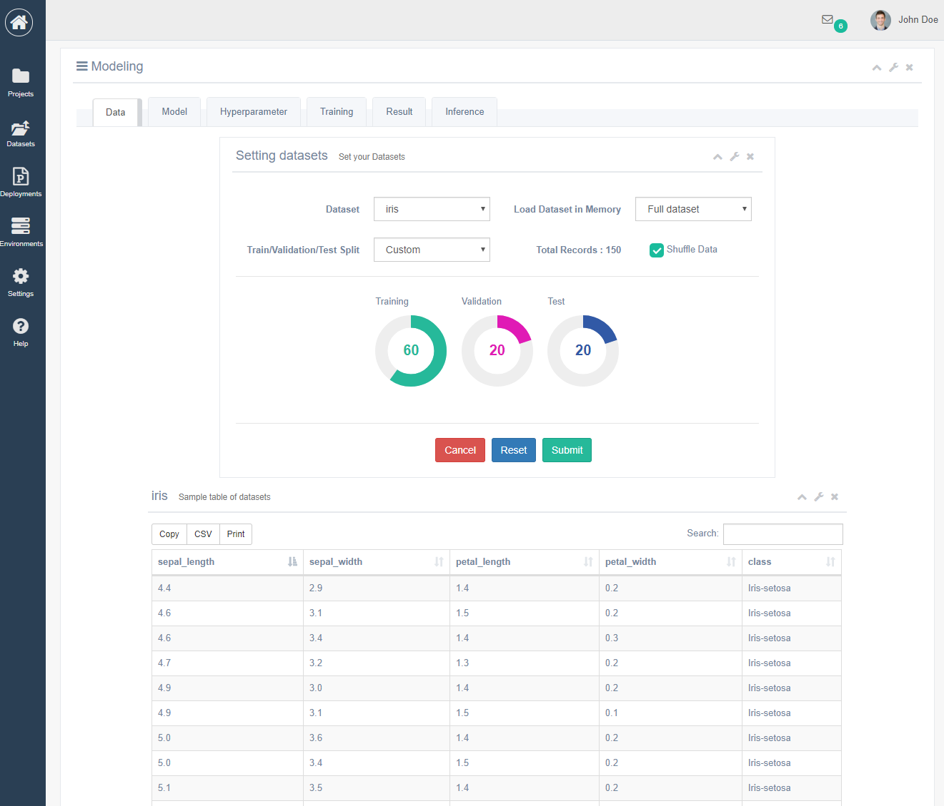
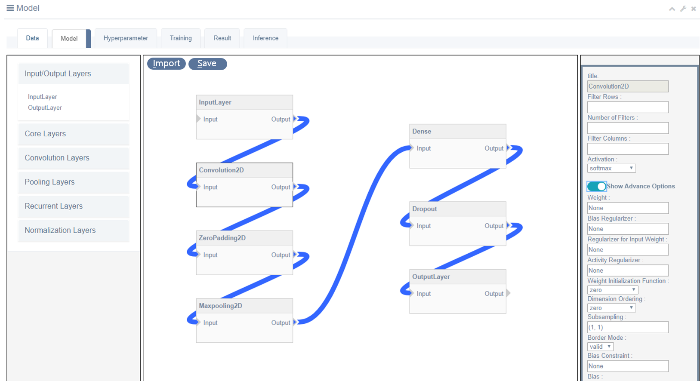
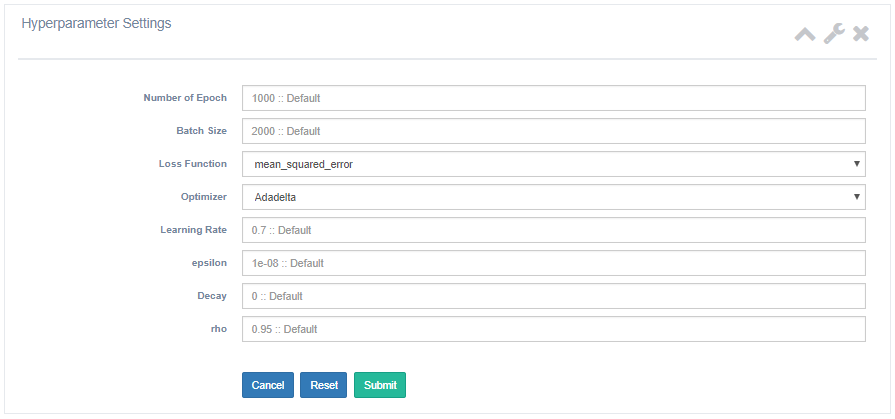
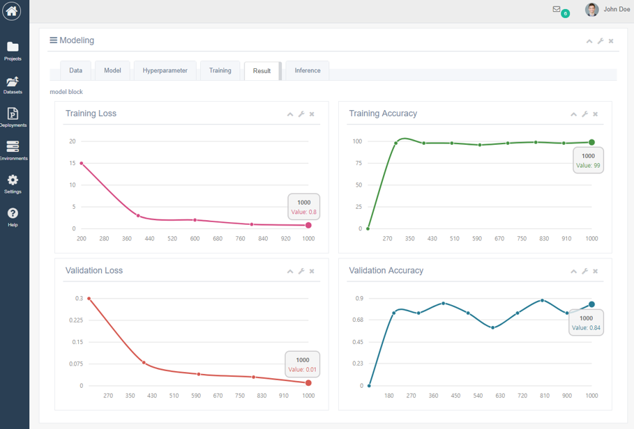

Autonomic Machine Learning Project
=============

<br>

Overview
----------------
This project supports autonomic machine learning tool for non-experienced developers. With this tool, they can easily generate their machine learning models and also run their models. 


<br><br>

<br><br>

<br><br>

<br><br>
<br>

Environments
----------------
+ Python 3.5
+ Tensorflow 1.11.0
+ Django 2.0
+ sqlite3
+ Keras 2.2.0

<br>

How to Run?
----------------
```
1. git clone 
2. https://github.com/AutonomicMachineLearning/MLFramework.git
3. $ python  manage.py  runserver  # It will be run by localhost.
4. Get on the internet "localhost:8000"
```

<br>


